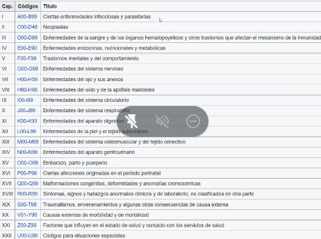
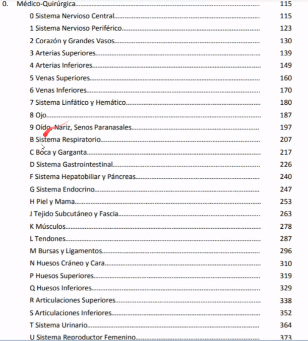
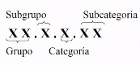
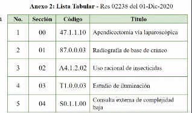
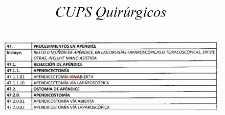
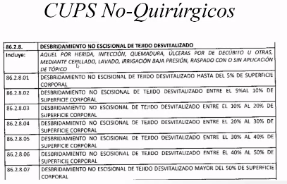
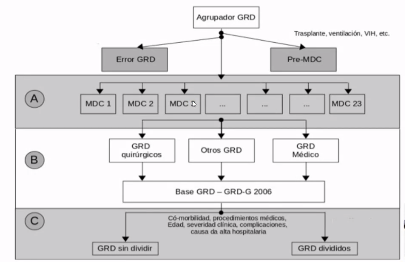
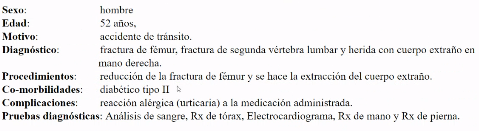
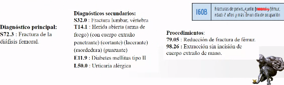

# Protocolos de codificación en informática médica 

Fecha: 23/11/2021

Protocolos de información: HIS, LIS, RIS.

### CIE

**Clasificacion internacional y estadística de enfermedades y problemas relacionados con la salud- International statical classification of discases and related health problems**
Sigla CIE- Clasifiación internacional de enfermedades

Se utiliza a nivel internacional para fines estadísticos relacionados con:
1. Morbilidad
2. Mortalidad
3. Los sistemas de reíntegro
4. Soportes de decisión automática en medicina 

Este sistema esta diseñado para promover la comparación internacional de:
1. La recolección
2. Procesamiento
3. Clasificación
4. Presentación de estas estadísticas

Existen algunos paisen que han hecho adaptaciones de esta codificación internacional con los códigos y epidemiologías locales.

Por ejemplo:
* Australia 1era edición, la CIE-10-AM en 1998 
* Alemania: la CIE-10-GM
* Canadá publicó su versión en el 2000, la CIE-10-CA
* Colombia: CUPS- resolución 365 de 1999

### ¿Qué codifica la CIE?

Cada afección puede ser asignada a una categoría y recibir un código de hasta seis caracteres de longitud. 

### CIE-10-ES
Estas agrupados por códigos 
Ejemplo:

  

  

cómo codifica los diagnosticos la CIE
1. Primer codigo hace referencia al capitulo
  

  

### CUPS- Clasificación única de procedimientos en salud

Adopta procedimientos que relaciona la CIE10 

Es una lista tabular que consta de dos secciones:
* **Seccion 00**: procedimientos quirúrgicos 
  

* **Seccion 01**: procedimientos no quirúrgicos 

  

Estas dos secciones contemplan los relacionado con el individuo. Cada secciín esta integrada por capítulos descritos por dos dígitos.

### Definición y uso de los GRD (grupos relacionados por el diagnostico) 

Sistemas de clasificación de pacientes que proveen medios para relacionar el tipo de pacientes que un hospital trata(es decur casuística), son los costos en que ese hosputal incurre

1. Monitoreo epidemiológico
2. La gestión clínica- Indicadores de mortalidad, promedio días de estancia y estimación de costos.
3. La comparación estandarizada de la actividad del hospital con otros hospitales
4. El presupuesto y planeación hospitalaria
5. El desarrollo e implementación de sistemas de pago prospectivo. 

Nace aproximadamente desde los 60's . En latinoamerica a finales de 2010 empezó.

Los Grupos Relacionados por el Diagnóstico (GRD) son algoritmos de agrupación de pacientes que ayudan a la gestión clínica y a la gestión financiera de hospitales y centros de atención sanitaria, cuya validez ha sido reconocida a nivel internacional. En los últimos años, estos algoritmos han adquirido gran relevancia en distintos países de América Latina. En el caso de Colombia, son muchas las IPS y EPS que están consiguiendo importantes avances en gestión clínica y gestión financiera gracias a su utilización.

  

Información requerida para la clasificación en GRD

1. Datos de indentificación del paciente
    
    1.1 Identificación del paciente
    
    1.2 Fecha de nacimiento
    
    1.3 Sexo
    
    1.4 Municipio
    
    1.5 CIAS_PRO
2. Datos de identificación del episodio 
    2.1 Financiador

    2.2 Fecha de ingreso
    
    2.3 Tipo de ingreso
    
    2.4 Servicio responsable del alta 
    
    2.6 Área clínica
    
    2.7 Fecha de alta
    
    2.8 Médico
    
    2.9 Tipo de alta 
    
    2.10 Fecha de la intervención
3. Variable clínicas
    
    3.1 Diagnostico principal
    
    3.2 Diagnostico secundarios
    
    3.3 Procedimientos diagnósticos y terapéuticos
    
    3.4 Morgología de las neoplasías

Tener en cuenta que esta información solo se obtiene cuando el paciente se ha desplazado. 

**Ejemplo de clasificación**
  

  

### Problemáticas actuales de estas codificaciones

1. Los códigos CIE y CUPS (para el caso de Colombia) se deben ingresar manualmente
2. En muchas ocasiones, el médico no es suficientemente específico en el código y hace que la codificación quede mal.
3. En ocasiones, no se actualizan los diagnósticos cuando estos cambian
4. Para el caso de los GRD, portan a la gestión en forma retrospectiva.
5. Si hay problemas de gestión con un paciente, no se puede hacer nada en el instante porque no hay evidencia. 

### Soluciones desde la IM

1. Utilizar procesamiento del lenguaje natural para **sugerir** códigos de diagnósticos y/o procedimientos a los médicos, con base en lo que este escriba en la HCE
2. Utilizar algoritmos de ML para clasificación, que prediga el GRD del paciente durante la estancia hospitalaria. 

