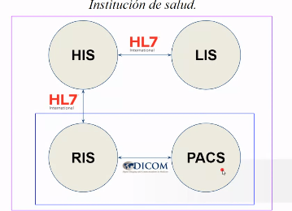
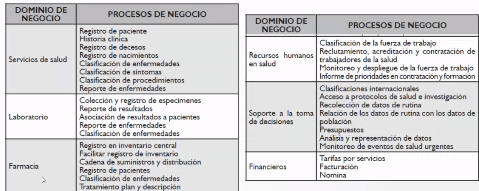
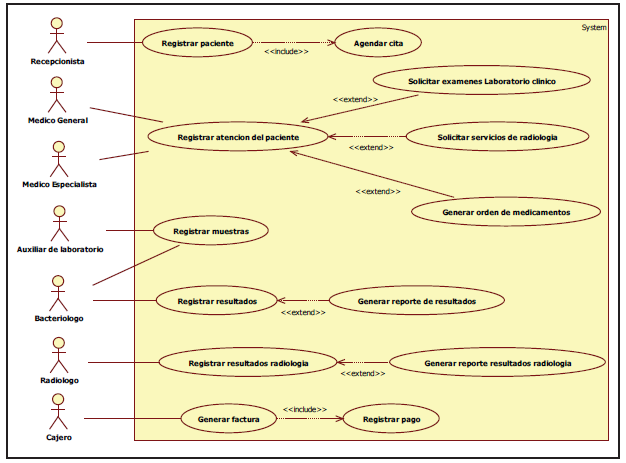
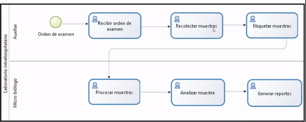
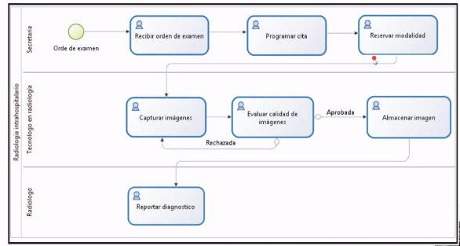
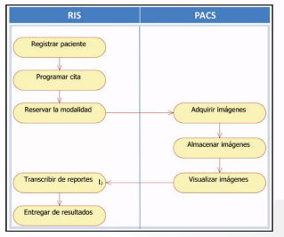

# Sistemas de información 

Fecha: 23/11/2021

## Sistema de información en salud

Digitalización de toda la información que llegan a los centros médicos, hospitales, en general a las IPS. Facilitar el proceso de atención al usuario.

En cualquier institución hospitalaria moderna es de gran utilidad contar con herramientas informáticas que permiten:
*" Agilizar procesos administrativos, clínicos y científicos"*

Sin embargo, existen inconvenientes cuando no se sabe cual es la solución idónea para los problemas de la institución. 

Existen diferentes escesarios (IPS) donde es posible implementar sistemas de información en salud como:
* Centros médicos
* Hospitales
* Clínicas
* Centros de imágenes diagnósticas
* Laboratorios clinicos 

No basta con tener los daots, hay que **procesarlos, analizarlos e interpretarlos**, para satisfacer las necesidades de las áreass administrativas, clínicas y de investigación en las organizaciones de salud. Con un enfoque de mejora en la atención del paciente y su familia.

Al digitalizar la información se ahorra espacio de infraestructura. 

1. Asistencial
2. Administrativa 

### 1. Sistemas de información asistenciales
  

### HIS sistema de información hospitalaria (Hospital information systems)

Son sistemas diseñados para gestionar aspectos clínicos, administrativos, y financieros de un hospital- 

El objetivo del HIS, están orientados a satisfacer las necesidades de:
* Almacenar
* Procesar
* Interpretar

Datos clínicos y administrativos, brinddno una perspectiva general de la institución que ayuda a mejorar la administración de ella y apoya la toma de decisiones.

**Dominios de negocios con un enfoque de arquitectura empesarial**

  

**Componentes del HIS** 
* Gestion de citas 
* Registro
* Historia clínica electrónica (EMR)
* Sistema de información radiológica (RIS)
* Sistema financiero
* Sistema de gestión de emergencia (EMS)
* Sistema de información de laboratorio (LIS)
* Sistema de gestión de farmacia (PMS)
* Gestión de seguros
 

   
*Tomado de: Informática Médica: Sistemas de Información y Estándares en Salud: Modelo
de Aplicación*

**Problemáticas del HIS**
Los principales problemas de los HIS es la interoperabilidad, lo anterior se debe a que los proveedores de software ofrecen productos que resuelven problemas puntuales como LIS, RIS o PACS por separado

### LIS-Sistema de información laboratorio clínico (Laboratory information systems)
Son los encargados de automatizar las tareas cotidianas de un laboratorio, estos pueden funcionar como subsistemas de un HIS o de manera independiente. 

**Flujo de trabajo del LIS**
  

**LIMS- Laboratory information management systems**: Orientado al ámbito de laboratorios de investigación o farmacéutico.

Captura de los datos procesados y almacenamientos de estos en el LIS:
* json
* xml

**Flujo de trabajo en el departamento de radiología**

  

### RIS Sistemas de información en radiología

Sistema que controla todo el departamento de diagnóstico por imágenes
* Manejo de turnos
* Stock de insumos
* Facturación del servicio
* Creación y almacenamiento de reportes
* Informes de diagnósticos
* Estadísticas

Tener en cuenta que solo es administrativo no se enfoca en la adquisición, diagnostico o almacenamiento de los estudios. 
Su enfoque esta centrado en la gestión del departamento a un nivel más alto.

### PACS-Sistemas de archivo y comunicación de imágenes (Picture archiving and communication system)
La responsabilidad es para el PACS . Permite recopilar, analizar, archivar e intercambiar imágenes diagnósticas de manera que se puede tener acceso a ellas en diferentes sitios dentro o fuera de la IPS donde se encuentre la modalidad por medio de redes de comunicaciones. 

#### Servicios que proporciona los PACS
* Servicio de adquisición de imágenes
* Servicio de gestión de imágenes
* Servicio de gestión de datos asociados con las imágenes
* Servicio de almacenamiento
* Servicio de visualización y procesamiento de imágenes
* Impresión de estudios
* Otros servicios especiales como:
    - Acceso a través de internet
    - Envió de estudios vía e-mail

### Requerimiento para la implementación de PACS
1. Redes de comunicación de alta velocidad
2. Acceso concurrente a los diferentes recuros (modalidades)

### RIS VS PACS
1. Es fácil de confundir, a menudo los proveedores de PACS ofrecen servicios de RIS
2. Proveedores con soluciones 100% integradas 

  
