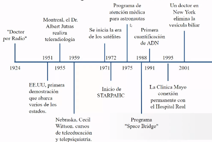
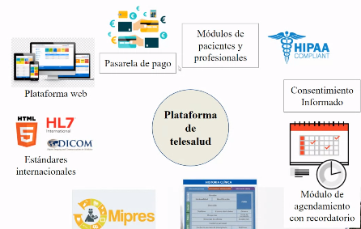

# Telemedicina

Fecha: 30/11/2021

La telemedicina que significa prestación de servicios médicos a distancia. 

La telemedicina puede ser tan simple como:
* Dos profesionales de la salud discutiendo un caso por teléfono.
* La utilización de avanzada tecnología en comunicaciones e informática para realizar **consultas, diiagnósticos o cirugías a distancia** y en tiempo real. 

Como servicio, beneficia a todos los pacientes de un sistema sanitario, pero sobre todo a las personas mayores y los pacientes crónicos y por supuesto a personas en lugares distantes. 

## Cronología de la telemedicina 
* El origen de la telemedicina está ligado al de las telecomunicaciones
* A principios del siglo XIX apareció telégrafo
* Telégrafo fue adoptado por la telemedicina en situaciones militares
* Se utilizó el telégrafo para pedir suministros médicos, informar muertos y heridos en el campo de batalla. 
* A finales del siglo XIX, Alexander G Bell, patentó el teléfono 
* Teléfono se masificó hasta principios del siglo XX.

   

La telemedicina busca mejorar la salud de un paciente, permitiendo la comunicación interactiva en tiempo real entre el paciente y el médico o profesional a distancia. Esta comunicación electrónica conlleva el uso de equipos de telecomunicaciones interactivas que incluyen, como equipamiento mínimo, audio y video. *Según Medicare.gov*. 

La telemedicina es la prestación a distancia de servicios clínicos de salud gracias a la infraestructura de telecomunicaciones. Es un recurso tecnológico de atención en salud, ahorrando tiempo y dinero. 

**La telemedicina incluye servicios:**
* Diagnóstico y tratamiento
* Eduación médica
* Servicios complementarios e instantáneos a la atención de un especialista
* Diagnóstico inmediatos por parte de un médico especialista
* Servicios de archivo digital de exámenes radiológicos, ecografías y otros. 

## Aplicaiones de la temedicina
* Telediagnósis
* Teleconsulta
* Teleradiología 
* Monitorización remota
* Reuniones médica para obtener segundas opiniones (teleconferencia).
* Almacenamiento digital de datos o ficha médicas. 

Es la provisión de servicios de salud a distancia en los compoentes de **promoción, prevención, diagnóstico, tratamiento y rehabilitación**, por profesionales de la salud. 

- *Resolución octubre de 2019 0002654- Telemedicina en Colombia*
- Complemento *Resolución 0003100 25 de noviembre de 2019*
- *Decreto 538 12 abril 2020- telesalud* Se implemnto y se masificó

Obligados a cumplir con la normatividad:
* Instituciones prestadores de servicios de salud-IPS
* Entidades promotoras de salud- EPS
* Planes adicionales
* Entidades adaptadas
* Secretarías de salud
* Administradora de riesgos laboralres- ARL
* Supersalud
* Profesionales incritos en ReTHUS (Registro único nacional del talento humano en salud)

## Comunicación con el paciente 
1. Garantizar la identificación del personal de salud.
2. Si usa inteligencia artificial: identificar el responsable de la plataforma.
3. Garantizar la identificación del usuario
4. Garantizar el tratamiento condifencial de la información 
5. Garantizar la protección de datos personales (leyy 1581 de 2012)

## Qué debería tener una plataforma de telesalud
* Plataforma web 
* Multiplataforma 
* Estándares internacionales 
    - HTML 5
    - HL7
    - DICOM
* Mipres: sistema que permite conocer los que no pertenecen al sistema POS 
* Historia clínica propia
* Módulo de agendamiento con recordatorio. Alarmas. 
* Consentimiento informado
* HIPAA compliant : seguros médicos, acuerdos, seguridad de la información.
*  Módulos de pacientes y profesionales.
* Pasarela de pago

 

### TELEMAP- Para salvar vidas
Telemap es un programa llevado a cabo por la facultad de medicina de la universidad de Antioquia que usa las TIC para la tele asistencia pre-hospitalaria, telemedicina, teleeducación y telentrenamiento para dar un servicio ágil, profesional y completo. 

### LIVINLAB- Telesalud
Teleasistencia prehospitalaria 
* Promotores de salud.
* Personal de la policía nacional
* Personal de los grupos de socorro
* Cuidadores
* Profesores
* Líderes comunitarios
* Agentes de tránsito

### Cuidado en casa- HomeCare
Cuidado con atenciones en casa. En términos de costo-beneficio, es más barato este tipo de cuidado que estar en un hospital. 

Según la cartera, a corte del 30 de junio del 2021 se generaron más de 151 millones de consultas de las cuales, el 79% correspondieron a acciones para tartar patologías no covid-19. 

