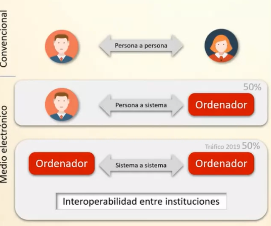
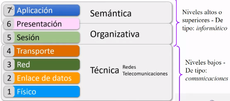
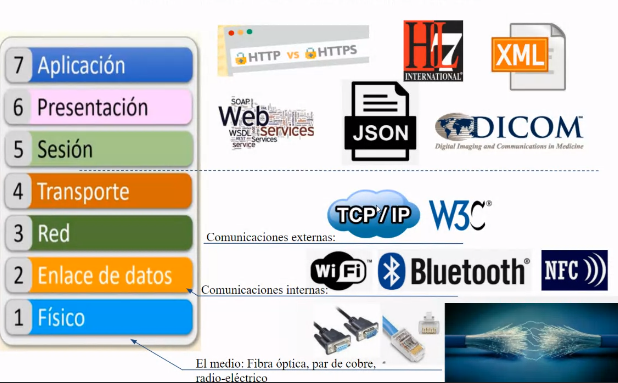

# Interoperabilidad 

Fecha: 07 diciembre 2021 

La Interoperabilidad es la habilidad de dos o más sistemas o componentes para intercambiar información y utilizar la información intercambiada. 

**ISO/IEC 2382**: La capacidad de comunicar, ejecutar programas o transferir datos entre varias unidades funcionales de forma que el usuario no tenga la necesidad de conocer la característica únicas de estas unidades. 

En el marco colombiano, la capacidad de las organizaciones para intercambiar información y conocimiento en el marco de sus procesos de negocio para interactuar hacia objetivos mutuamente beneficiosos, con el propósito de facilitar la entrega de servicios digitales a ciudadanos, empresas y a otras entidades, mediante el intercambio de datos entre sus sistemas. 

Ejemplo de interoperabilidad 
1. **Físico:** tiene que ver con el cómo se prepara la información:
    * Embalaje
    * Remitente 
    * Tamaño 
2. **Enlace de datos:** El nivel de enlace de datos tiene que ver los servicios que se encargan de la recogida y el transporte.
    * Logística
    * Aduana
    * Impuesto
    * Seguros
    * Falta de operación en algún lugar
3. **Red:** Hace referencia un conjunto de operadores logísticos
    * Logística
    * Aduana
    * Impuesto
    * Seguros
    * Falta de operación en algún lugar
4. **Transporte**: reunificación de paquetes que han llegado en transportes diferentes.
    * Llegadas a tiempo
    * Con retrasos
    * Provenientes de otros operadores
    * Diferentes medios 
5. **Sesión**: pre-consideración del tema por parte del destinatario (Doctor)
    * Disponibilidad horaria
    * Agendamiento
    * Prioridad
    * Posible remisión a otra colega
6. **Presentación**: Entender lo que se esta pidiendo.
    * Recepción del paquete y sus condiciones
    * Traducir papelería
    * Entender las estándares
    * Tablas
    * Unidades de medida
7. **Aplicación**: Hace referencia a las aplicaciones informáticas y lo que ahora se conoce como las APP
    * Atiene el caso porque:
        - Es su especialidad.
        - Historia clínica bien escrita.
        - Porque tenían un acuerdo pre-establecido.
        - Porque llegó en las condiciones. adecuadas de tiempo y forma.

  

### Niveles de abstracción 
  

### La torre de babel en los servicios de salud 
- python hl7
- Pydicom 
