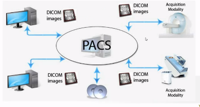

# DICOM

Fecha: 25 de enero 2022 

Autor: Luisa María Zapata Saldarriaga 

Estándar DICOM (`Imagenología digital y comunicaciones en medicina`). Es un estándar de transmisión de imágenes médicas y datos entre dispositivos médicos. 

Su aplicación más común es:

a. Visualización
b. Almacenamiento . Guarda la ubicación de la imagen en la base de datos.
c. Impresión
d. Transmisión de las imágenes

Se implementa en casi todos los dispositivos de
1. Radiología
2. Imágenes de cardiología 
3. Radioterapia (rayos X, tomografía computarizada, resonancia magnética, ultrasonido, etc)

**DICOM** es un protocolo desde los 90's ha revolucionado la práctica de la radiología. 

Fabricantes que traen sus equipos para comercialización y los cuales ya tenía implementados estos protocolos. 

## PACS (Picture archiving and Coommunication System)

Es un sistema de comunicación y archivado de imágenes. Sirve para almacenar la información digitalizada, y de igual forma sirve para enviar información a otra área.

El almacenamiento de la nube, tiene almacenamiento redundante, por tanto es necesario realizar un sistemas de respaldo. 

su función primordial es: 
"Almacenar imágenes y facilitar la comunicación entre los sectores de hospitales y clínicas"

Un sistema PACS ideal debe atender todo el flujo de imagen desde la adquisición del examen, hasta el diagnóstico, proceso de informe

## Ventajas de esta sistematización

**IPS**
* Ahorro en materiales de impresión y revelado
* No uso de material altamente peligroso.
* Uso de espacio de revelado en otro propósito
* Ahorro en desechos hospitalarios
* Facilidad en teleconsulta con pares
* Almacenamiento de copias de resultados. 
* Evitar pérdida de exámenes en manos de pacientes.

**Pacientes**
* No cargar con los acetatos
* Se libra de problemas por pérdida o deterioro.

**Médico**
* Evita recibir tanto papel para atención a pacientes. 

El objetivo del formato `DICOM`, es hacer compatibles las imágenes que se pueden obtener de una gama cada vez más amplia de técnicas, equipos y fabricantes y facilitar la vida a los médicos que deben hacer las interpretaciones. 

Un archivo DICOM tiene dos partes:
1. `La cabecera`, que es un tabla que incluye todos los datos de información del paciente. 
2. `El cuerpo` con los datos de la imagen.

De esta manera la información del paciente va siempre incluida en el mismo fichero que la imagen y la imagen va siempre perfectamente identificada. Tener en cuenta la `trazabilidad`. 

