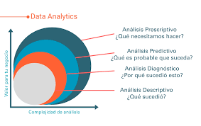
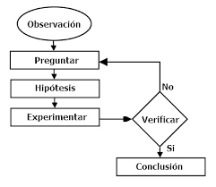
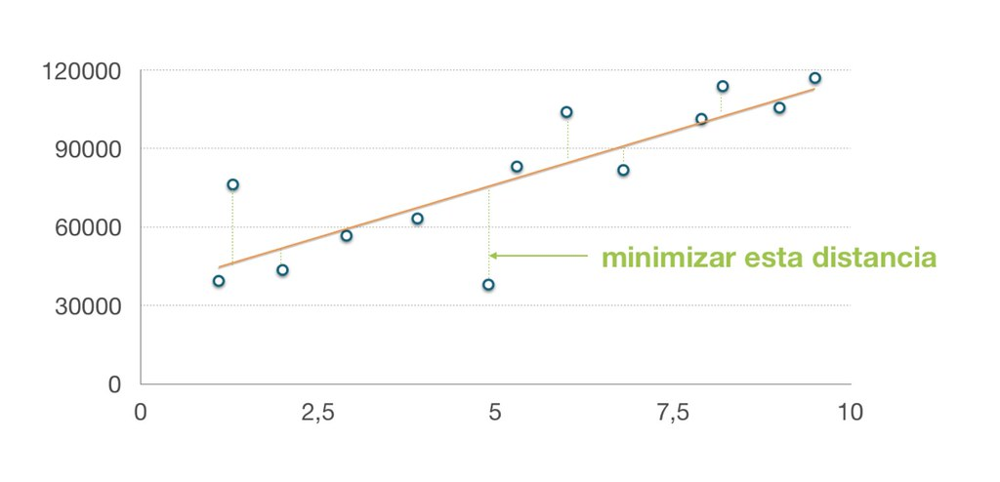

# Fecha: 1/03/2022 
Autor: Luisa María Zapata Saldarriaga 

## 1. Analítica de datos 

Conjunto con enfoques cuantitativos y cualitativos para la obtención de información valiosa de datos. Procesos que incluyen la extracción de datos, con el objetivo de hallar: 
* Patrones
* Relaciones
* Conexiones y otra información importante de este tipo

Ej: Algoritmos supervisados se basan en asociar patrones.

**Modelos de data analytic**
- 4: **Análisis prescriptivo** : ¿ Qué es probable que suceda?
    Entra en juego la inteligencia artificial
- 3: **Análisis predictivo** ¿ Qué es probable que suceda?

    Trabaja de manera que se predice lo que va a ocurrir a un corto plazo. 
    Ayuda a identificar:
    * Tendencias relacionadas entre variables
    * Determinar la fuerza de su correlación 
    * Formula hipótesis de causalidad.
    
- 2: **Análisis diagnóstico** ¿Por qué sucedió?

    Se centra en conocer por qué sucedió cierta situación. 

    Ej: 
    * "El clima afectó las ventas de cerveza"

- 1: **Análisis descriptivo** ¿Qué sucedió?

 

## 2. Generación de modelos de AI
ML: science + engineering 
1. Se realizan experimentos (Ciencia)
2. Desarrollan los productos (Ingeniería)

Plantilla del modelo ->Calibración del modelo ->Modelo

**Flujo del método científico**

  

* **Diseñador** del algoritmo ML:se enfoca en cómo se genera un modelo. 
* **Usuario** de algoritmos de ML: se enfoca en calibrar modelos respecto a unos datos concretos
* **Product Owner** de un modelo de ML: se enfoca en mantener un modelo operativo y con beneficio en producción 

**Calibración de un modelo 1D**

* Probabilidades de equivocarse 
* Ver ejemplos

## 3. Tipos de aprendizaje
En Ml existen dos tipos de aprendizaje:
1. **Supervisado**: conozco la salida. 
* Se llama aprendizaje supervisado, porque actúa como una guía para enseñar al algoritmo, se ingresan las muestras que debe analizar y la respuesta que debe retornar 'y'.
* Es el más utilizado
* Es más costoso porque se requiere un panel de expertos que anote el dataset. 
* Incluye algoritmo (plantillas) como: regresión lineal, regresión logística, SVM (Máquinas de soporte vectorial), entre otros. 
2. **No supervisado**: No conozco la salida.
* Puede estar más acoidado con lo que se espera de la AI, que una computadora aprenda solo de los humanos, de su entorno y saque sus propias conclusiones
* Algunos algoritmos para este tipo de entrenamiento serían clustering, K-mean, reglas de asociación. 
* Para este tipo de aprendizaje no existe un conjunto de datos anotado. En este caso el conjunto de datos solo tiene las entradas 'x' y el algoritmo tiene la capacidad de encontrar patrones y sacar sus propias conclusiones.
* No requiere el esfuerzo (costo) adicional para el etiquetado de las muestras. 

## 4. Tipos de problemas
En ML existes dos tipos de problemas:
Tiene que ver con el formato de las salidas del sistema. 
1. **Clasificación**: los resultados son binarios
* Se usan cuando el resultado deseado, es decir, la salida son valores discretos, son etiquetas finitas
* Cuando el modelo que se construye tiene como salida,una etiqueta binaria, es decir, 1 o 0, true o false, negro o blanco. 
Se dice que un problema de clasificación biclase, precedir si:
    - Un alumno perderá o no la materia
    - Si un cliente comprará o no un producto 
2. **Regresión**:
* Son útiles para predecir respuestas donde la salida es continua
* La salida esta dada como respuesta sensible a un conjunto de variables de entrada y no se limita a un conjunto de respuestas lineal entre los atributos. 
    - Predecir el precio de una vivienda
    - Predecir el valor futuro del dólar
    - Predecir los ingresos que un cliente generará

Se pueden estimar los errores 

## 5. Medidas de error

