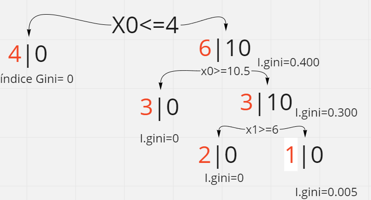

# Fecha: 08/03/2022 

## Árbol de decisión
* Algoritmo de Ml que podría ser de los más sencillo, pero a su vez muy poderoso. 
* Son muy usados cuando se tiene datasets  relativamente complejos

Los algoritmos de clasificación buscan separar clases.

El algoritmo más utilizado en la actualidad para implementar árboles de decisión, se conoce como : **CART**
Para hacer el proceso de separación, empieza a sacar un errores con respecto a una región binaria. Una de las desventajas es que consume mucho consumo de máquina.
Se definen fronteras, y se empieza a clasificar. 

Índice Gini, sea el menor de todos. Hace referencia al nivel de impureza, entre más alto el índice, más impura la combinación de datos.

### Importancia de las características 
Determinar que variable es más importante para realizar el árbol de decisiones 

