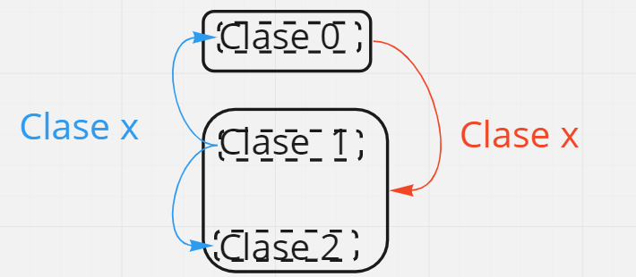
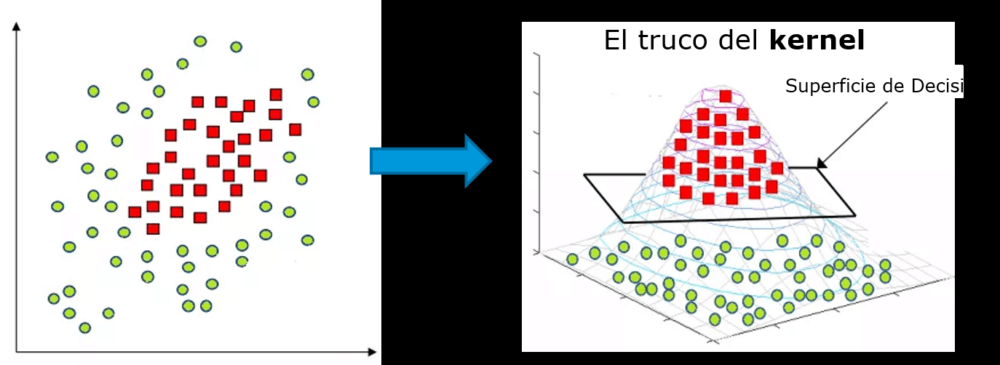
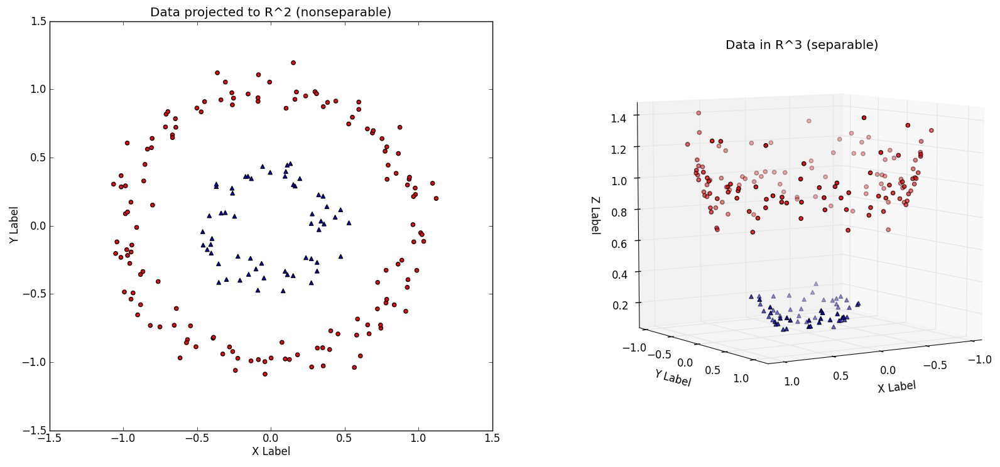

Fecha: 17 de marzo 2022

# Máquina de soporte vectoria- SVM 

Encontrar la frontera que mejor divida los datos. 
No compara uno con otra clase. Compara una clase con todos. 

  

Se saca lo más relevante para la imagen y luego se le mete una máquina de soporte vectorial, de forma que se haga la clasificación.

Las máquinas de soporte vectorial, busca la mejor separación entre dos clase, si es más clases uno contra el resto. 
Traza un hiper-plano, dependiendo de las dimensiones que este, que sea equidististante entre dos los dos puntos más cercanos. Empieza hallar todas las posibles separaciones. Cada punto es multidimensional. 

Encuentra cual es el que mejor separa los elementos. 

## El truco del Kernel en SVM
cuándo hay puntos que son difíciles de separar. El kernel le agrega una dimensión. 
  
  

**Ventajas**
* Tienen buena predicción y buena precisión, más rápido en comparación con otros algoritmos
* Uso de menos memoria porque utiliza un subconjunto de datos de entrenamiento
* Funciona bien cuando los puntos están claramente separados

**Desventajas**
* No son adecuados para grandes grupos de datos. debido a su alto tiempo de formación
* Funciona mal con funciones superpuestas
* sensible al tipo de kernel utilizado

Cuando se tienen clases desbalanceadas se recomienda usar `stratifie`
